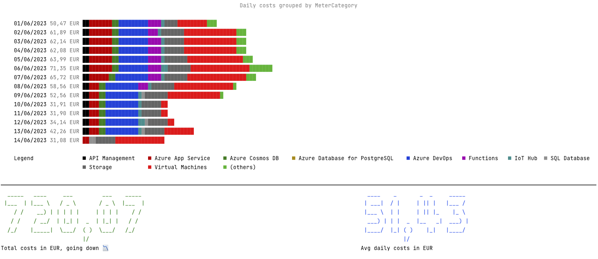
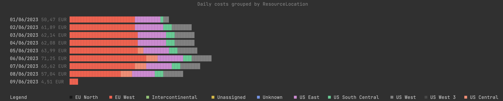

# Azure Cost CLI

[](https://www.nuget.org/packages/azure-cost-cli)
[](https://github.com/mivano/azure-cost-cli/releases/latest)
[](https://github.com/mivano/azure-cost-cli/actions/workflows/dotnet.yml)

This is a simple command line tool to get the cost of your Azure subscription. It uses the Azure Cost Management API to get the cost and output the results to the console, text, csv, markdown or JSON. E.g. so it can be used in a workflow to get the cost of your subscription and use it in subsequent steps.


Besides showing the accumulated cost, it can also show daily cost, extract resource (costs) and list budgets. 

<picture>
  <source media="(prefers-color-scheme: dark)" srcset="screenshot_daily_metercategory_dark.png">
  <source media="(prefers-color-scheme: light)" srcset="screenshot_daily_metercategory.png">
  
</picture>

It can also detect anomalies and trends in the cost, which can be used to further automate reporting.


## Installation

You can install this tool globally, using the dotnet tool command:

```bash
dotnet tool install --global azure-cost-cli 
```

## Upgrading

When there is a new version available on NuGet, you can use the `dotnet tool update` command to upgrade:

```bash
dotnet tool update --global azure-cost-cli 
```

With a `--version` parameter, you can specify a specific version to install. Use the `--no-cache` parameter to force a re-download of the package if it cannot find the latest version.

## Usage

You can invoke the tool using the `azure-cost` command. You can use the `--help` parameter to get a list of all available options. Some of the commands have additional parameters which can be shown by adding the specific command with the `--help` option.

```bash
azure-cost --help
```

Which will show:

```bash
USAGE:
    azure-cost [OPTIONS]

EXAMPLES:
    azure-cost accumulatedCost -s 00000000-0000-0000-0000-000000000000
    azure-cost accumulatedCost -o json
    azure-cost costByResource -s 00000000-0000-0000-0000-000000000000 -o text
    azure-cost dailyCosts --dimension MeterCategory
    azure-cost budgets -s 00000000-0000-0000-0000-000000000000
    azure-cost detectAnomalies --dimension ResourceId --recent-activity-days 4


OPTIONS:
    -h, --help            Prints help information
        --debug           Increase logging verbosity to show all debug logs  
    -s, --subscription    The subscription id to use. Will try to fetch the active id if not specified.
    -o, --output          The output format to use. Defaults to Console (Console, Json, JsonC, Markdown, Text, Csv)
    -t, --timeframe       The timeframe to use for the costs. Defaults to BillingMonthToDate. When set to Custom, specify the from and to dates using the --from and --to options
        --from            The start date to use for the costs. Defaults to the first day of the previous month
        --to              The end date to use for the costs. Defaults to the current date
        --others-cutoff    10         The number of items to show before collapsing the rest into an 'Others' item                                                                
        --query           JMESPath query string. See http://jmespath.org/ for more information and examples  
        --useUSD          Force the use of USD for the currency. Defaults to false to use the currency returned by the API        
        --skipHeader      Skip header creation for specific output formats. Useful when appending the output from multiple runs into one file. Defaults to false 
        --filter          Filter the output by the specified properties. Defaults to no filtering and can be multiple values.
    -m, --metric           ActualCost    The metric to use for the costs. Defaults to ActualCost. (ActualCost, AmortizedCost)    

COMMANDS:
    accumulatedCost    Show the accumulated cost details
    costByResource     Show the cost details by resource
    dailyCosts         Show the daily cost by a given dimension
    detectAnomalies    Detect anomalies and trends  
    budgets            Get the available budgets   
    regions            Get the available Azure regions 

```

> When you do not specify a subscription id, it will fetch the actively selected one of the `az cli` instead. 

> If the application is not working properly, you can use the `--debug` parameter to increase the logging verbosity and see more details.

> This tool uses the Azure Cost Management API to get the cost. Not all subscriptions have access to this API. To check if your subscription has access, you can use the `az account subscription show --subscription-id yourid --query '[subscriptionPolicies.quotaId]' -o tsv
` command. Validate the resulting quota id with the ones on the [Microsoft list](https://learn.microsoft.com/en-us/azure/cost-management-billing/costs/understand-cost-mgt-data#supported-microsoft-azure-offers) to see if it is supported. Running the tool with the `--debug` parameter will also show the quota id that is used.

> There is a pretty strict rate limit on the cost api; the calls are retried after a 429 is received, but it might take a while before the call succeeds as it honors the retry time out.

## Authentication

To make the call to the Azure cost API, you do need to run this from a user account with permissions to access the cost overview of the subscription. Further more, it needs to find the active credentials and it does so by using the `ChainedTokenCredential` provider which will look for the `az cli` token first. Make sure to run `az login` (with optionally the `--tenant` parameter) to make sure you have an active session.

## Use in a GitHub workflow

You can use this tool in a GitHub workflow to get the cost of your subscription and store the results in markdown as a Job Summary. This can be used to get a quick overview of the cost of your subscription. Have a look at the [workflow](https://github.com/mivano/azure-cost-cli/actions/workflows/create-markdown.yml) in this repository for an example output.

```yaml
name: Azure Cost CLI Workflow

on:
  workflow_dispatch:
    inputs:
      az-subscription-id:
        description: 'Azure Subscription ID'
        required: true
jobs:
  run-azure-cost-cli:
    runs-on: ubuntu-latest
    steps:
      - name: Azure Login
        uses: azure/login@v1
        with:
          creds: ${{ secrets.AZURE_CREDENTIALS }}

      - name: Install Azure Cost CLI
        run: dotnet tool install -g azure-cost-cli

      - name: Run Azure Cost CLI
        run: azure-cost accumulatedCost -o markdown --subscription ${{ github.event.inputs.az-subscription-id }} >> $GITHUB_STEP_SUMMARY

```

The last step output the markdown to the Job Summary. This can be used to show the cost of the subscription in the workflow summary. Use it on a schedule to get for example a daily overview. Alternatively you can use the `-o json` parameter to get the results in JSON format and use it for further processing.

## Available commands

### Accumulated Cost

This will retrieve the accumulated cost of the subscription. This is the total cost of the subscription since the beginning of the period specified. We will try to fetch the forecast as well and organise by location, type and resource group. You can use the different formatters to get the results in different formats.

```bash
azure-cost accumulatedCost -s 574385a9-08e9-49fe-91a2-27660d92b8f5
```

> This is the default command when you do not specify a command.

### Cost By Resource

This will retrieve the cost of the subscription by resource. This will fetch the resource details including the meter information. It is up to the formatter how this is returned. Use the `json` formatter to get the full details.

```bash
azure-cost costByResource -s 574385a9-08e9-49fe-91a2-27660d92b8f5 -o json
```

If you are only interested in the cost of the resources, you can exclude the meter details using the `--exclude-meter-details` parameter.

```bash
azure-cost costByResource -s 574385a9-08e9-49fe-91a2-27660d92b8f5 --exclude-meter-details
```

Do keep in mind that with the `--metric` you can either request the ActualCost or the AmortizedCost cost, but not both at the same time. The default is ActualCost.

A resource can be in multiple resource locations, like Intercontinental and West Europe. When you use `--exclude-meter-details`, the resource will be listed once and the locations will be combined.

You can parse out the resource name, group name and subscription id from the ResourceId field. The format is `/subscriptions/{subscriptionId}/resourceGroups/{resourceGroupName}/providers/{resourceProviderNamespace}/{resourceType}/{resourceName}`.

### Daily Costs

The daily overview fetches the cost of the subscription for each day in the specified period. It will show the total cost of the day and the cost per dimension. The dimension is the resource group by default, but you can specify a different one using the `--dimension` parameter. 

For example:

```bash 
azure-cost dailyCosts -s 574385a9-08e9-49fe-91a2-27660d92b8f5 --dimension ResourceLocation
```



The default dimension is the resource group.

```bash 
azure-cost dailyCosts 
```


The above screenshots show the default console output, but the other formatters can also be used.

The available dimensions are: `ResourceGroup`,`ResourceGroupName`,`ResourceLocation`,`ConsumedService`,`ResourceType`,`ResourceId`,`MeterId`,`BillingMonth`,`MeterCategory`,`MeterSubcategory`,`Meter`,`AccountName`,`DepartmentName`,`SubscriptionId`,`SubscriptionName`,`ServiceName`,`ServiceTier`,`EnrollmentAccountName`,`BillingAccountId`,`ResourceGuid`,`BillingPeriod`,`InvoiceNumber`,`ChargeType`,`PublisherType`,`ReservationId`,`ReservationName`,`Frequency`,`PartNumber`,`CostAllocationRuleName`,`MarkupRuleName`,`PricingModel`,`BenefitId`,`BenefitName`

### Detect Anomalies

Based on the daily cost data, this command will try to detect anomalies and trends. It will scan for the following anomalies:

- Cost that is stopped; although it is good that the cost is stopped, it might be an indication that something is wrong.
- Cost that is appearing; the cost was not there before and is now adding to the overall cost.
- A spike in cost; a deviation from the normal cost pattern
- A gradual increase in cost; so a service is growing in cost over time.

There are a number of settings you can use to finetune the detection.

```
--dimension               ResourceGroupName    The grouping to use. E.g. ResourceGroupName, Meter, ResourceLocation, etc. Defaults to ResourceGroupName                                               
--recent-activity-days    7                    The number of days to use for recent activity. Defaults to 7                                                                                           
--significant-change      0,75                 The significant change in cost to use. Defaults to 0.75 (75%)                                                                                          
--steady-growth-days      7                    The number of days to use for steady growth. Defaults to 7                                                                                             
--threshold-cost          2                    The thresshold cost to use. Values lower than this are excluded. Defaults to 2.00      
```

All the different formatters can be used to output the data, so you can further process it with the JSON or CSV output, send it via email with the text formatter, or use the markdown formatter to include it in a GitHub workflow. The console output will render the different anomalies in different and point out the moment in time where the anomaly was detected.


```bash 
azure-cost detectAnomalies
```

### Budgets

This will retrieve the available budgets for the subscription. It will show the current status of the budget and the amount of the budget. As well as listing the configured notifications. 

```bash
azure-cost budgets -s 574385a9-08e9-49fe-91a2-27660d92b8f5 
```

### Regions

Retrieve a list of available regions. Besides the location and supported compliances, it will also show the available sustainability information.

```bash
azure-cost regions
```

> Not all the formatters are supported for this command. Let me know if there is a need.

## Filter

With the `--filter` option you can pass in one or more properties to filter on. 

```bash
azure-cost --filter "ResourceGroupName=yourresourcegroup;myresourcegroup" --filter "owner=me" 
```

In the example above, we look for resources in either `yourresourcegroup` or `myresourcegroup` and having a tag named `owner` with the value `me`.

Filters are passed along to the Cost API, so less data is retrieved. Compared to the query, where the data is queried with a JMESPATH expression and can be projected as well.

Multiple filters are combined with an `and` expression, while the values are split by the `;` and used as an `or`.

## Query

Use the `--query` to specify a [JMESPath](https://jmespath.org) expression. This allows you to filter the results. For example, to get the yesterday cost of the subscription, you can use the following query:

```bash
azure-cost -s 574385a9-08e9-49fe-91a2-27660d92b8f5 -o json --query "totals.yesterdayCost"
```

Or to list only the resource groups:

```bash
azure-cost -s 574385a9-08e9-49fe-91a2-27660d92b8f5 -o json --query "ByResourceGroup[*].[ResourceGroup, Cost]"
```

will output:

```json
[["mindbyte-sand-api",28.94824],["rg-test",16.457219149662315],["rg-weu",0.252499694771765],["cloud-storage-westeu",0.183537445632]]
```

For the JMESPath parsing, it uses the [JMESPath.Net](https://github.com/jdevillard/JmesPath.Net) library. Not all constructions might be implemented yet. If you find a query that does not work, please open an issue with a reproducable path at their repo.

## Timeframe

The default timeframe is the billing month to date. You can specify a custom timeframe using the `--from` and `--to` parameters and setting the `-t custom`. The timeframe is specified in the ISO 8601 format. 

Other options are:

- BillingMonthToDate
- Custom
- MonthToDate
- TheLastBillingMonth
- TheLastMonth
- WeekToDate

These options are based on the types exposed by the [query API](https://learn.microsoft.com/en-us/rest/api/cost-management/query/usage?tabs=HTTP#timeframetype).

## Output formats

The tool supports multiple output formats. The default is `Console` which will output the results to the console. You can specify a different format using the `--output` parameter. The different commands generate different outputs using the specified formatter. The following formats are supported:

### Console

The default output format. It will output the results to the console in a graphical way. For example the accumulated costs:


### Json / JsonC

The Json format is great for further processing of the data. It will output the results in a JSON format to the console. Using the > operator, you can redirect the output to a file. Use `jsonc` to get a colorized output.

```bash
azure-cost accumulatedCost -s 00000000-0000-0000-0000-000000000000 -o json > cost.json
```

```json
{
  "totals": {
    "todaysCost": 0.521266170218092,
    "yesterdayCost": 2.367501588413211,
    "lastSevenDaysCost": 17.089367673307038,
    "lastThirtyDaysCost": 30.887236456720686
  },
  "cost": [
    {
      "Date": "2023-04-01",
      "Cost": 2.365348403419757,
      "Currency": "EUR"
    },
    // snip
  ],
  "forecastedCosts": [
    {
      "Date": "2023-04-13",
      "Cost": 0,
      "Currency": "EUR"
    },
    // snip
  ],
  "byServiceNames": [
    {
      "ServiceName": "API Management",
      "Cost": 19.524664,
      "Currency": "EUR"
    },
    // snip
  ],
  "ByLocation": [
    {
      "Location": "EU West",
      "Cost": 30.68711937543843,
      "Currency": "EUR"
    },
    // snip
  ],
   "ByResourceGroup": [
    {
      "ResourceGroup": "rg-west-eu",
      "Cost": 30.68711937543843,
      "Currency": "EUR"
    },
    // snip
  ]
}
```

> **Tip**: Use the `--query` parameter here to manipulate the results, like filtering and projecting the data. Do keep in mind that it operates over the already fetched data.

### Text

A simple textual format. It will output the results in a simple text format.

```
Azure Cost Overview for 574385a9-08e9-49fe-91a2-27660d92b8f5 from 01/04/2023 to 14/04/2023                                                                    

Totals:
  Today: 0,52 EUR
  Yesterday: 2,37 EUR
  Last 7 days: 17,09 EUR
  Last 30 days: 30,89 EUR

By Service Name:
  API Management: 19,52 EUR
  Azure App Service: 5,32 EUR
  Azure Monitor: 3,67 EUR
  Container Registry: 2,06 EUR
  Log Analytics: 0,17 EUR
  Storage: 0,13 EUR
  Key Vault: 0,00 EUR
  Bandwidth: 0,00 EUR

By Location:
  EU West: 30,69 EUR
  Unknown: 0,20 EUR
  US West: 0,00 EUR
  US West 2: 0,00 EUR

```

Or when using the daily cost:

```
Daily Costs:
------------
Date        Cost (EUR) Breakdown
01/06/2023  50,47 Virtual Machines: 12,09 (23,95%), Azure DevOps: 10,63 (21,06%), Azure App Service: 7,67 (15,19%), Storage: 5,84 (11,58%), Functions: 4,75 (9,41%), IoT Hub: 1,51 (2,99%), API Management: 1,48 (2,93%), Azure Cosmos DB: 1,47 (2,91%), App Configuration: 1,12 (2,23%), Container Registry: 0,94 (1,85%), Other: 2,98 (5,90%)
02/06/2023  61,89 Virtual Machines: 20,08 (32,45%), Azure DevOps: 10,81 (17,47%), Storage: 8,69 (14,03%), Azure App Service: 7,67 (12,39%), Functions: 4,75 (7,67%), IoT Hub: 1,51 (2,44%), API Management: 1,48 (2,39%), Azure Cosmos DB: 1,47 (2,37%), App Configuration: 1,12 (1,81%), Container Registry: 0,94 (1,51%), Other: 3,38 (5,46%)
03/06/2023  62,14 Virtual Machines: 20,08 (32,31%), Azure DevOps: 10,99 (17,69%), Storage: 8,69 (13,98%), Azure App Service: 7,67 (12,34%), Functions: 4,75 (7,64%), IoT Hub: 1,51 (2,43%), API Management: 1,48 (2,38%), Azure Cosmos DB: 1,47 (2,36%), App Configuration: 1,12 (1,81%), Container Registry: 0,94 (1,51%), Other: 3,45 (5,55%)
04/06/2023  62,08 Virtual Machines: 20,08 (32,35%), Azure DevOps: 10,99 (17,70%), Storage: 8,69 (13,99%), Azure App Service: 7,67 (12,35%), Functions: 4,75 (7,65%), IoT Hub: 1,51 (2,43%), API Management: 1,48 (2,38%), Azure Cosmos DB: 1,47 (2,36%), App Configuration: 1,12 (1,81%), Container Registry: 0,94 (1,51%), Other: 3,39 (5,45%)
05/06/2023  63,99 Virtual Machines: 21,51 (33,62%), Azure DevOps: 10,99 (17,18%), Storage: 8,95 (13,98%), Azure App Service: 7,67 (11,98%), Functions: 4,75 (7,42%), IoT Hub: 1,51 (2,36%), API Management: 1,48 (2,31%), Azure Cosmos DB: 1,47 (2,29%), App Configuration: 1,12 (1,76%), Container Registry: 0,94 (1,46%), Other: 3,60 (5,63%)
06/06/2023  71,25 Virtual Machines: 23,36 (32,79%), Azure DevOps: 10,99 (15,43%), Storage: 9,30 (13,05%), Azure App Service: 7,67 (10,76%), Functions: 4,75 (6,66%), Azure Cognitive Search: 4,09 (5,74%), IoT Hub: 1,51 (2,12%), API Management: 1,48 (2,07%), Azure Cosmos DB: 1,47 (2,06%), Load Balancer: 1,13 (1,58%), Other: 5,51 (7,74%)
07/06/2023  65,62 Virtual Machines: 23,35 (35,58%), Azure DevOps: 11,53 (17,58%), Storage: 9,28 (14,14%), Azure App Service: 6,87 (10,47%), Functions: 4,75 (7,24%), IoT Hub: 1,51 (2,30%), API Management: 1,48 (2,25%), Azure Cosmos DB: 1,47 (2,24%), App Configuration: 1,12 (1,71%), Load Balancer: 1,08 (1,65%), Other: 3,18 (4,84%)
08/06/2023  57,04 Virtual Machines: 21,94 (38,47%), Azure DevOps: 11,72 (20,54%), Storage: 9,23 (16,18%), Functions: 3,56 (6,25%), Azure App Service: 2,61 (4,58%), IoT Hub: 1,51 (2,65%), API Management: 1,48 (2,59%), Azure Cosmos DB: 1,46 (2,56%), SQL Database: 0,89 (1,56%), Azure Database for PostgreSQL: 0,71 (1,25%), Other: 1,93 (3,38%)
09/06/2023  4,51 Virtual Machines: 1,86 (41,19%), Storage: 1,54 (34,08%), Azure App Service: 0,33 (7,24%), API Management: 0,18 (4,09%), Azure Cosmos DB: 0,18 (4,00%), Virtual Network: 0,10 (2,24%), Load Balancer: 0,09 (2,09%), Azure Database for PostgreSQL: 0,09 (1,97%), SQL Database: 0,06 (1,40%), Container Registry: 0,04 (0,86%), Other: 0,04 (0,83%)

```

### Csv

A CSV format. It will output the results in a CSV format which can be used in Excel or other tools. It will use the default culture of your system to format the numbers. If you combine the output of multiple runs into one file (like using the `>>` to append to a file), you can use the `--skipHeader` parameter to prevent the header from being written multiple times.

```bash
azure-cost accumulatedCost -s 574385a9-08e9-49fe-91a2-27660d92b8f5 -o csv > cost.csv
```

```csv
Date,Cost,CostUsd,Currencycost
01/05/2023,"2,366588585885843","2,563252097372957",EUR
02/05/2023,"2,36675103555328","2,563428046607759",EUR
03/05/2023,"2,366643737168579","2,563311831727289",EUR
04/05/2023,"2,366407861778791","2,563056355092609",EUR
05/05/2023,"2,367958990965315","2,564736383114534",EUR
06/05/2023,"1,904236728129323","2,06247880023687",EUR
07/05/2023,"2,36694351092248","2,613934066287242",EUR
08/05/2023,"0,521257579853968","0,575650808311731",EUR
```

### Markdown

A markdown format. It will output the results in a series of simple tables.

```bash
azure-cost accumulatedCost -s 574385a9-08e9-49fe-91a2-27660d92b8f5 -o markdown > cost.md
```

```markdown
# Azure Cost Overview

> Details for subscription id `574385a9-08e9-49fe-91a2-27660d92b8f5` from **01/04/2023** to **20/04/2023**

## Totals

|Period|Amount|
|---|---:|
|Today|0,00 EUR|
|Yesterday|1,27 EUR|
|Last 7 days|15,48 EUR|
|Last 30 days|45,84 EUR|

## By Service Name

|Service|Amount|
|---|---:|
|API Management|28,95 EUR|
|Azure App Service|7,89 EUR|
|Azure Monitor|5,51 EUR|
|Container Registry|3,06 EUR|
|Log Analytics|0,25 EUR|
|Storage|0,19 EUR|
|Key Vault|0,00 EUR|
|Bandwidth|0,00 EUR|

## By Location

|Location|Amount|
|---|---:|
|EU West|45,55 EUR|
|Unknown|0,30 EUR|
|US West|0,00 EUR|
|US North Central|0,00 EUR|
|US West 2|0,00 EUR|

## By Resource Group

|Resource Group|Amount|
|---|---:|
|mindbyte-sand-api|28,95 EUR|
|mindbyte-sand-azuremonitor|5,51 EUR|
|mindbyte-sand-registry|3,06 EUR|

<sup>Generated at 2023-04-21 07:40:23</sup>

```

Excluded in the above sample, but it will also include mermaidjs diagrams as well.

## Iterate over multiple subscriptions

Since the tool operates on a single subscription only, you will need to loop over multiple subscriptions yourself. You can do this by using the `az account list` command and then using the `--subscription` parameter to switch between subscriptions.

```bash
az account list --query "[].id" -o tsv | while read -r id; do
    echo "Subscription: $id"
    azure-cost accumulatedCost -o markdown -s $id
done
```

Or using Powershell

```powershell
az account list --query "[].id" -o tsv | ForEach-Object {
    Write-Host "Subscription: $_"
    azure-cost accumulatedCost -o markdown -s $_
}
```

Or this snippet by [@EEN421](https://github.com/EEN421) to get the cost by resource for each subscription and append it to a single CSV file.

```powershell
#Connect to Azure
Connect-AzAccount -UseDeviceAuthentication -Tenant xxxxxxxx-xxxx-xxxx-xxxx-xxxxxxxx

#Pull list of Subscriptions
$ids = Get-AzSubscription -TenantId xxxxxxxx-xxxx-xxxx-xxxx-xxxxxxxx| Select-Object id,name
$firstid = $ids | Select-Object -first 1
$remainingids = $ids | Select-Object -skip 1

#Create CSV for first subscription with header
$firstoutput = azure-cost costByResource -s $firstid.id -t Custom --from 2023-05-01 --to 2023-05-31 -o csv
Add-Content ".\report.csv" $firstoutput

#Loop through remaining subscriptions and append to CSV
Foreach ($id in $remainingids) {
$output = azure-cost costByResource -s($id.id) -t Custom --from 2023-05-01 --to 2023-05-31 -o csv --skipHeader
Add-Content ".\report.csv" $output
}
```

Using the `--skipHeader` parameter is important here, otherwise you will get a header for each subscription which will mess up the output file as it will append the data to the same file.

## Is there cost involved?

No, the calls to the Azure Cost APIs are [free](https://learn.microsoft.com/en-us/azure/cost-management-billing/automate/automation-faq#am-i-charged-for-using-the-cost-details-api), although there are some [rate limits](https://learn.microsoft.com/en-us/azure/cost-management-billing/automate/get-small-usage-datasets-on-demand#latency-and-rate-limits) in place. Avoid pulling data too often as it will only be refreshed every [4 hours](https://learn.microsoft.com/en-us/azure/cost-management-billing/automate/get-small-usage-datasets-on-demand#request-schedule).

## Let's Connect!

I appreciate every star ⭐ that my projects receive, and your support means a lot to me! If you find my projects useful or enjoyable, please consider giving them a star.

For inquiries, suggestions, or contributions, feel free to open an issue or a pull request. You can also reach out to me directly via [LinkedIn](https://www.linkedin.com/in/michielvanoudheusden/).

